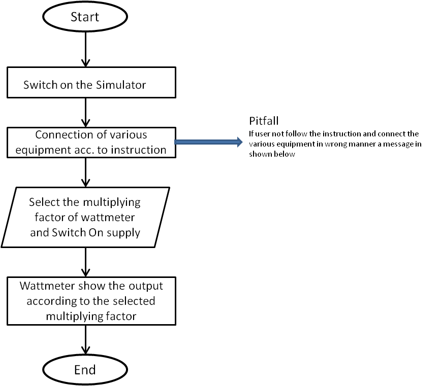
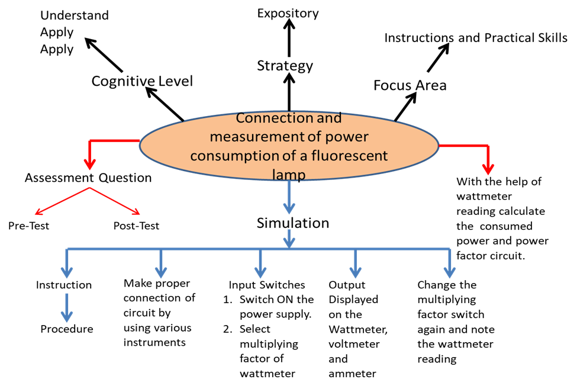

## Storyboard (Round 2)

Experiment 1: Connection and measurement of power consumption of a fluorescent lamp (tube light)
### 1. Story Outline:

The experiment is based on the connection and measurement of power consumed in a fluorescent lamp and calculation of the power factor of the circuit.
The formula for calculation of power and power factor of the 1-phase circuit required three values i.e. voltage (V), current (I) and Power factor (Cos Φ ). The 1-phase supply voltage and frequency is already have a fixed value. Connection of various equipment is properly done after that switch ON the supply and measure the reading of wattmeter by selecting the multiplying factor of the wattmeter. The final power is calculated by multiplying the wattmeter reading with the multiplying factor to obtain the final power consumed by fluorescent lamp and also voltage and current in the circuit.
The simulator will perform operations in interaction with user, and the value of power consumed by fluorescent lamp and finally the power factor of circuit is calculated.

### 2. Story:

This experiment is based on connection and measurement of power of a fluorescent lamp and at last the power factor of the circuit. 
When user clicks on the simulation button, simulator for the connection and measurement of power of fluorescent lamp opens up. The simulator screen is partitioned into five areas namely Canvas working area, Power switch and equipment area, instruction area, power supply switch and multiplying factor selector switch of wattmeter area and last output reading area.
First the working area is the space provided in the simulator so that user place the equipment and draw the circuits according to the instruction shown in the instruction area. In starting there is no equipment in the working area. Then from power and equipment area user firstly switch on the simulator and then select different equipment to complete the circuit. After completing the circuit according to the instruction in the instruction window, if instruction is not followed properly then a message in lower tab is shown. Then switch on the circuit button from input switch area and select the multiplying factor switch of wattmeter. It has two switch to select the multiplying factor i.e. 2 and 4. After selecting the multiplying factor  output is shown in the output reading area i.e. wattmeter reading, voltmeter reading and ammeter readings.
The output metering area has three meter: wattmeter which shown the reading both analog and digital form, digital voltmeter and digital ammeter. After noting the reading power consumed by fluorescent lamp is calculated and finally the power factor of the circuit.

#### 2.1 Set the Visual Stage Description:
When the user enters the simulator, he sees a screen divided into 2 columns consisting of two and three rows individually. That indicates that a total of five blocks. 
The first block in first column contains our main canvas (circuit board). The second block in first column circuit equipment contain Enable/disable Switch, starter, choke coil, fluorescent tube, 1-Φ supply, connecting wires, wattmeter, ammeter and voltmeter.
The second column, the first-row instructions appear as soon as everyone presses the button of equipments and wires (follow the instructions) they change subsequently. Below that contains Switch to ON the supply and select the multiplying factor of wattmeter having two switch (2 and4). 
In, second column and last row shows the output metering box where output is shown in both analog and in digital form.
Instructions are as follows:
Step 1: Click on the ON button to start the Simulator.
Step 2: Now click on selector switch of different equipments
Step 3: connect the components by clicking on their specified buttons.
Step 4:  connect the wires
Step 5: switch on the 1-Φ supply switch and select the multiplying factor to see corresponding output in output meter.

#### 2.2 Set User Objectives & Goals:
The main objective of this experiment is to understand the connection diagram and how to calculate power and power factor of fluorescent lamp in single phase circuit.
At the end of the module user would be able to understand:
1. Fluorescent lamp, starter, choke coil, ammeter, voltmeter and wattmeter connection in 1-Phase circuit.
2. Calculate the power consumed in the fluorescent tube.
3. Calculate the  power factor of the circuit.

#### 2.3 Set the Pathway Activities:

Path:
1.User follows the instructions and creates the circuit.
(Step 1: Click on the ON button to start the Simulator.
Step 2: Now click on switch and follow the instruction as appears in instruction box.
Step 3: connect the components by clicking on their specified buttons.
Step 4:  connect the wires
Step 5: switch on the supply and choose the multiplying factor of wattmeter.
Step6: Output is shown in the output metering block i.e. wattmeter reading, voltmeter reading and ammeter reading.
2. User select the another multiplying factor of wattmeter and note the output reading.

##### 2.4 Set Challenges and Questions/Complexity/Variations in Questions:

1. How choke coil and starter are connected in the
1-Phase circuit for measurement of power?
A. series and parallel
B. series and series
C. parallel and parallel
D.parallel and series
2. What is the formula for calculating power of 1-phase load?
A. VA Cos Φ
B. 3VA CosΦ
C. 3 VA Cos Φ
D. 2VA Cos Φ
3.What is the formula for calculating power factor in 1-phase circuit?

##### 2.5 Allow pitfalls:
Whenever a student tries to do something wrong. i.e not according to the instructions. He will get a bottom up message on the tab to make it right along with the instructions.  

##### 2.6 Conclusion:
The user after using this simulator were able to know how to make connection for measurement of the power consumed by the fluorescent tube and by using the reading of ammeter and voltmeter power factor of the circuit is also calculated. To use the simulator for measurement of power of fluorescent lamp takes nearly about 3-5mins to proper understand and run the simulator. The simulator mainly focus on the instrumentation and practical skills learned by the user. Learning objective like how to make connection and how to measure the power consumed by fluorescent lamp and finally the power factor of the circuit is achieved by the designed simulator. 

##### 2.7 Equations/formulas: NA

1.   P = VIcosΦ ,where P = Power of the circuit shown by wattmeter
                      V = Voltage shown by wattmeter
                      I = Current shown by ammeter
                      cosΦ = Power factor of the circuit

### 3. Flowchart 4
 
 

### 4. Mindmap:

### 5. Storyboard :
Storyboard: 
Link to storybaord (.gif file ) here :
. Software to be used for storyboarding : https://wonderunit.com/storyboarder/ (Its a FOSS tool) . tutorial on how to use it https://www.youtube.com/watch?v=LAeCEpG0KX4
